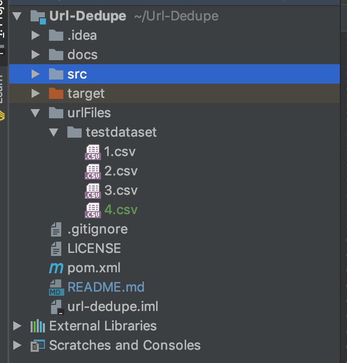
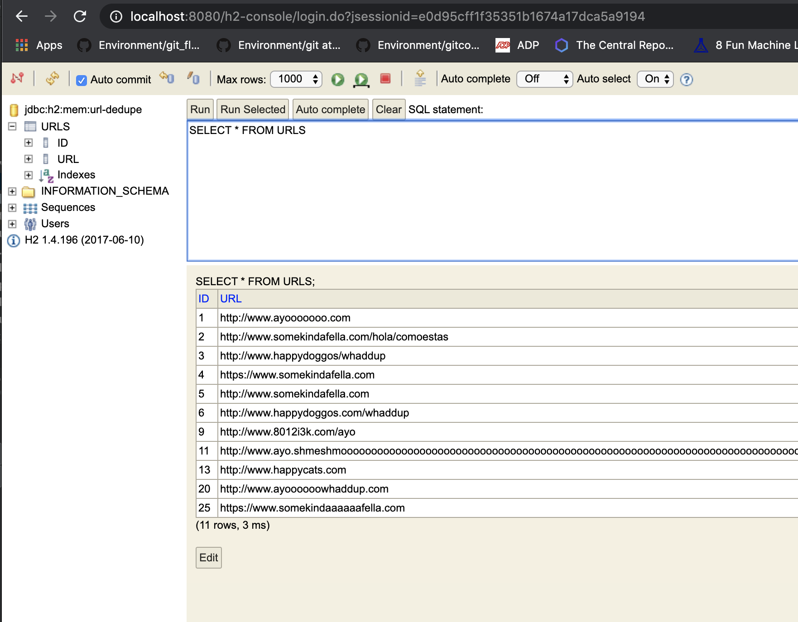

# V1 Strategy for Url-Dedupe
The V1 of this Application is not its final form. 

The strategy taken was to provide a proof of concept in order
to continue running various time tests, to prompt discussion, etc. This is because digging too deep
into an implementation without these kind of conversations often leads to a less optimal solution.

So here's to listening in on some of my initial thoughts!

## Chosen Input Format
- Any number of files that are stored within a directory of a users choosing
- Directory must be located within the `urlFiles` directory
- Each file should have around `50,000` urls within it (at least in the POC version)
- urls must be written one per line, with no deliminators.


 
#### _Any number of files that are stored within a directory of a users choosing_

Interesting choice, right?XD Well initially I considered having one massive File that was saved in a similar location and format. The problem then was
that I'd have to parse through that _entire_ file in order to split it up into easer-to-deal-with "chunks". However, after considering how that could possibly
be undertaken further, I realized that whoever the client was _had_ to write that billion url file at some point either way. So why not request that my client
parse them into separate files from the get go? It seemed like the winning strategy to save us both time!

Additionally, I did not want to send the data over the wire. My preferred architecture would be reading these values gradually off of some sort of MQ, or even just from a 
shared data storage. Because of that preference, I opted to not strategize further on how to send this massive content over the wire (for the POC).

#### _Directory must be located within the `urlFiles` directory_

I wanted to supply _some_ flexibility for users to test varying datasets, but I didn't want it to be a pain to run the jobs, either. Having it setup this way
simply allows for people evaluating the system to have more flexibility in testing!

#### _Each file should have roughly `50,000` urls within it._

To be honest... 50,000 is a made up number. It felt realistic to run within my current implementation, and also large enough to begin getting some good
time readings. The interesting thing is that since I'm running this on my own computer... I have a limited amount of threads that I can utilize. So 
splitting it up more or less than this 50,000 number doesn't seem to have _that_ much of an effect that I can readily quantify.

My guess is that this number would be way more fun to play with in a distributed system type architecture. Although I'd be excited to hear cases I'm not considering!
#### _URLS must be written one per line, with no deliminators._

Reading these massive files is time consuming enough, so I opted to avoid any need to undergo additional parsing within the files through requiring that each line has one and only
one thing... the url! #savingcomputingtime

## Chosen Output Format:

I opted to place the output within a database table; specifically for the POC I'm simply storing the unique urls within an H2 in-memory database table.
 
I did this POC because I'd prefer a final result to resemble a Distributed System with a Shared DataStore as opposed to a file system or simply a single
file which is output after running. Placing it in a DB storage earlier rather than later, _often_ could allow for an ease of usage down the line.

(I also didn't spin up a new DB instance because I ran out of free credits on AWS a while ago... O_O haha)

The POC solution can be seen by hitting this url when your application is running, and after you've successfully ran the dedupe job. The creds for login
can be found within this project's `application.yml` file.

```
http://localhost:8080/h2-console
```


 
## How does this application work??

Flow:
- Application starts, initializes the `urls` h2 db table

- Client saves files containing urls to be deduped within designated location.

- Job is triggered (in our case, just via a Restful API)

- File reader scans directory for list of Files within that directory.

- Java Parallel Stream API is then used process each File

- After each file read, a `Set` of Strings is created. 
  - `Set` was chosen because it does not allow for duplicates, so a simple and quick insert works fluidly.
  
- Then that `Set` of String urls is sent to the `UrlService` to be saved. This is also done via java's `parallelstream` API.
  - Note that in the current design, it is expected to run into some (or many) Unique index/ primary key violations when saving to the db.
  I determined for now that this strategy is okay since our end result is achieved without additional querying, or blocking mechanisms i.e., it saves time.
  
- At the end of the process all urls within the database are deduped! 

- Once application is terminated, database is also dropped.


## How clients should execute this fella
Running the Dedupe Application:
- Run the Application! See the `README` section for help getting started.

- Store Files that you'd like to test against (or use existing directory -- see the section on `Chosen Input Format` for more details)

- Run a GET on `http://localhost:8080/urldedupe/{yourDirNameHere}`
  - Working examples: 
  - http://localhost:8080/urldedupe/allRepeats10Files
  - http://localhost:8080/urldedupe/mostlyrepeatsonefile
  - http://localhost:8080/urldedupe/noRepeats10Files
  
- Query your result via the H2 console. http://localhost:8080/h2-console

## How much time and space your solution will take to execute.
<b>Memory:</b>

Although the memory usage of the H2 Db is significant, my implementation only uses H2 as a stand in for a real deployed database. This POC is for ease of portability, so because
of that, a real solution would be utilizing disk space... which for the problem is assumed to be unlimited.

As such, I will focus my discussion of space to just the memory concerns of my algorithm.

Foremost, all objects and their references instantiated within the course of my solution can be treated as constant space requirements.
Regardless of the size of the input, the only detail that scales in memory usage to that is the Set of urls.
The largest possible size for the Set will be equal to the largest number of urls within a single File that I'm reading in. So if my file size is N, then my in memory space will
be at most N.Since all other objects are constant in memory usage, my Overall Big O space complexity is N.


<b>Time:</b>

Total Runtime:
Best case scenario -> All urls are duplicates. Avg time estimate: roughly 8.6 minutes for 1 billion urls.
Worst case scenario -> No urls are duplicates. Avg time estimate: roughly 2 hours for 1 billion urls.

Math for best case:
```
See test dir: allRepeats10Files
Avg of 260 ms for 10 files of size 50,000 with no duplicates
50,000 urls x 10 files = 500,000 urls processed
1 billion divided by 500,000 urls equals 2,000
2,000 x 260 milliseconds = roughly 8.6 minutes

```

Math for worst case:
```
See test dir: noRepeats10Files
Avg of 33627 ms for 10 files of size 50,000 with all duplicates
50,000 urls x 10 files = 500,000 urls processed
1 billion divided by 500,000 urls equals 2,000
2,000 x 33627 milliseconds = roughly 2 hours

```

Note that in both cases, a distributed system could drastically cut process time.

## A testing approach.
Testing for performance. *phew* talk about a challenging task! Particularly in my V1 approach...

I'll start by bringing up some of the cases that I'd absolutely like to test.

Cases:
```
For all runs: Grab average after say... 50 runs. 
1 - 10 files, 50,000 in each. No duplicates at all.
2 - 10 files, 50,000 in each. All duplicates
3 - 10 files, 50,000 in each. Half Duplicates
4 - No Files at all
5 - Empty File
6 - A file with crazy long url sizes, and more unique characters
```

Further testing would involve monitoring this system in a production setting. Whether that be through dashboards giving insight into
what is going on, monitoring logs themselves, or setting up alerting systems. As well as running some time trials against other methods that either
my team produced, or that I produced (with some additional time, of course! haha)

## Next Steps for V2
Jira story titles that I might write out were I to turn this into a production ready application.

1 - Spike out what the top Database would be for this use case (Considering company needs/costs/etc)

2 - Modify Implementation to utilize new Database Schema

3 - Create a Lightweight Read Endpoint that Cursors through the DB (using something speedy like: https://www.postgresqltutorial.com/plpgsql-cursor/ )

3 - Improve Error Handling / Introduce Rollback Strategies

4 - Deploy this Application to the Cloud (likely AWS EC2)

5 - Spike on the best Log Aggregator to utilize for APM type monitoring/ dashboards/ etc... and the implement

6 - Deploy Application as a cluster to share the workload!:D
