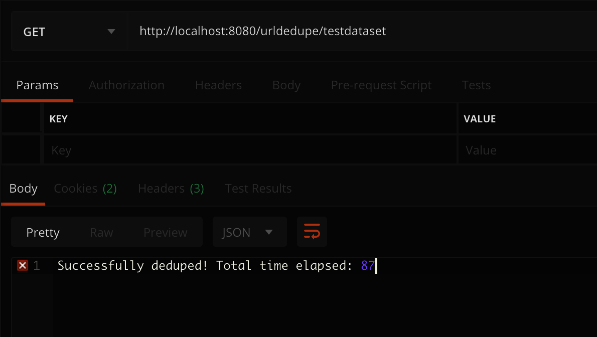
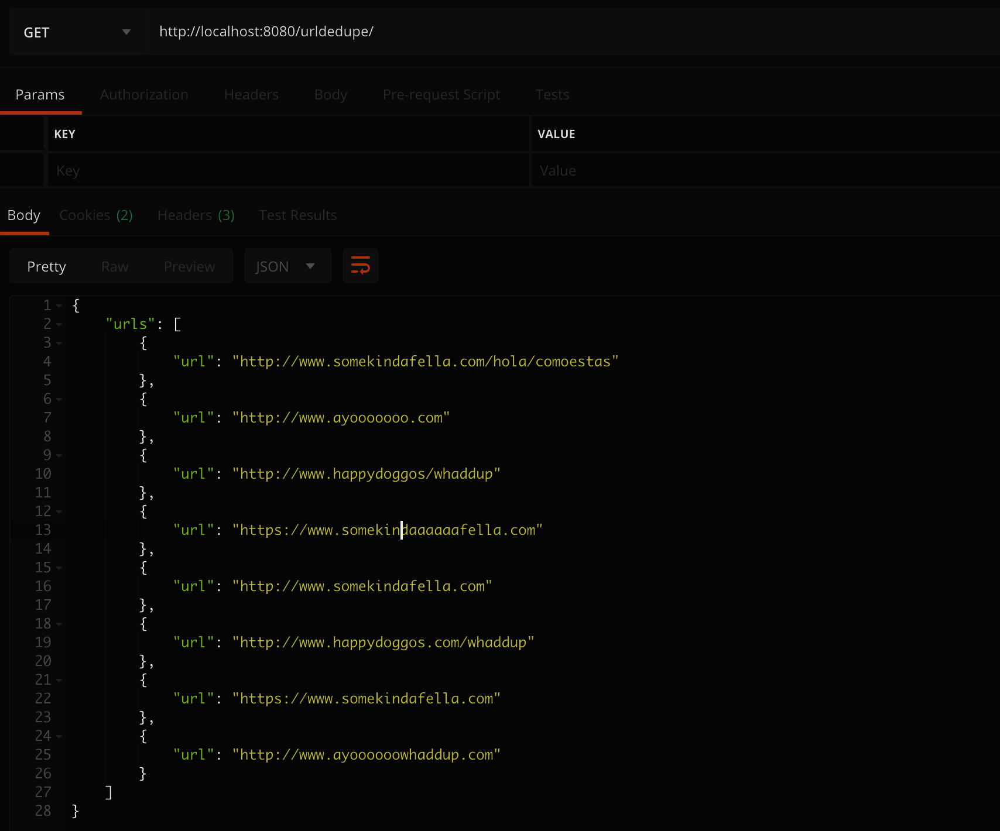

# V1 Strategy for Url-Dedupe
The V1 of this Application is not its final form. 

The strategy taken was to provide a proof of concept in order
to continue running various time tests, to prompt discussion, etc. This is because digging too deep
into an implementation without these kind of conversations often leads to a less optimal solution.

So here's to listening in on some of my initial thoughts!

## Ownership:
* GitHub: [MaddyCase](https://github.com/MaddyCase). 

## Chosen Input Format
- Any number of csv files that are stored within a directory of a users choosing
- Directory must be located within the `urlFiles` directory
- Each file must have no more than `1000000` urls within it.
- URLS must be written one per line, with no deliminators.

 
##### Any number of csv files that are stored within a directory of a users choosing

Interesting choice, right?XD Well initially I considered having on massive File that was saved in a similar location and format. The problem then was
that I'd have to parse through that _entire_ file in order to split it up into easer-to-deal-with "chunks". However, after considering how that could possibly
be undertaken further, I realized that whoever the client was _had_ to write that billion url file at some point either way. So why not request that my client
parse them into separate files from the get go? It seemed like the winning strategy to save us both time!

Additionally, I did not want to send the data over the wire. My preferred architecture would be reading these values gradually off of some sort of MQ, or even just from a 
shared data storage. Because of that preference, I opted to not strategize further on how to send this massive content over the wire (for the MVP).

##### Directory must be located within the `urlFiles` directory

I wanted to supply _some_ flexibility for users to test varying datasets, but I didn't want it to be a pain to run the jobs, either. 

##### Each file must have no more than `1000000` urls within it.

TODO: Fill me out!

##### URLS must be written one per line, with no deliminators.

Reading these massive files is time consuming enough, so I opted to avoid any need to undergo additional parsing within the files through requiring that each line has one and only
one thing... the url! :dancingcat:

## Chosen Output Format:

## How Does this Thing even Work??
Implementation details.

## How Clients should Execute this fella
Running the Dedupe Application:
- Run the Application! See the `README` section for help getting started.
- Store Files that you'd like to test against (or use existing `testdataset`  -- see the section on `Chosen Input Format` for more details
- Run a GET on `http://localhost:8080/urldedupe/testdataset`

If the dedupe was successful you should see something similar to (I used postman but anywhere will work)): 
 
 
 
If the get was successful you should see something similar to: 
 
  
## How much time and space your solution will take to execute.
Memory:

Total Runtime:

## A testing approach.